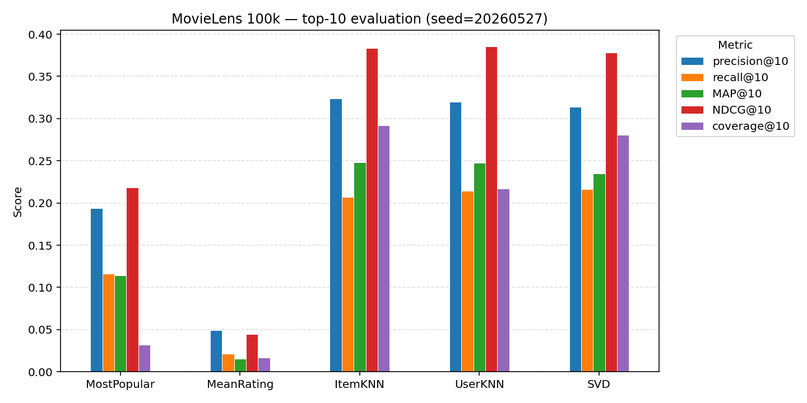
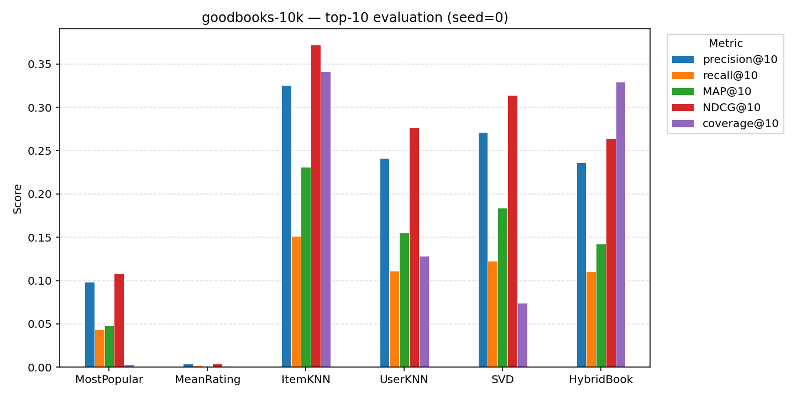

# Recommender Systems Library

[](https://github.com/Burton-David/Recommender-Systems/actions/workflows/ci.yml)
[](https://burton-david.github.io/Recommender-Systems/)
[](https://codecov.io/gh/Burton-David/Recommender-Systems)
[](https://www.python.org/downloads/)
[](https://opensource.org/licenses/MIT)
[](https://github.com/astral-sh/ruff)
[](https://mypy-lang.org/)

A collection of classic and modern recommender system algorithms with a unified API:
every algorithm implements `fit(ratings)` and `recommend(user, n)`, so they're
interchangeable. Typed, tested, and benchmarked.

## Benchmarks

Top-10 evaluation on **MovieLens 100k** (80/20 seeded split). Reproduce with
`pip install -e ".[dev,benchmarks]" && python -m scripts.benchmark`.



|             | precision@10 | recall@10 |  MAP@10 | NDCG@10 | coverage@10 |
|:------------|-------------:|----------:|--------:|--------:|------------:|
| MostPopular |       0.1935 |    0.1165 |  0.1139 |  0.2184 |      0.0321 |
| MeanRating  |       0.0489 |    0.0211 |  0.0154 |  0.0447 |      0.0166 |
| ItemKNN     |       0.3240 |    0.2070 |  0.2484 |  0.3833 |      0.2919 |
| UserKNN     |       0.3199 |    0.2141 |  0.2473 |  0.3856 |      0.2170 |
| SVD         |       0.3139 |    0.2166 |  0.2351 |  0.3780 |      0.2806 |

See [`benchmarks/results.md`](benchmarks/results.md) for the table regenerated from
the latest run.

Top-10 evaluation on **goodbooks-10k** (2500-user subsample, 80/20 seeded split).
Reproduce with `python -m scripts.benchmark_goodbooks`.



|             | precision@10 | recall@10 |  MAP@10 | NDCG@10 | coverage@10 |
|:------------|-------------:|----------:|--------:|--------:|------------:|
| MostPopular |       0.0979 |    0.0437 |  0.0517 |  0.1109 |      0.0036 |
| MeanRating  |       0.0036 |    0.0016 |  0.0014 |  0.0040 |      0.0014 |
| ItemKNN     |       0.3355 |    0.1534 |  0.2425 |  0.3841 |      0.3589 |
| UserKNN     |       0.2370 |    0.1085 |  0.1539 |  0.2729 |      0.1423 |
| SVD         |       0.2756 |    0.1241 |  0.1858 |  0.3173 |      0.0759 |
| HybridBook  |       0.3206 |    0.1472 |  0.2109 |  0.3507 |      0.3545 |

`HybridBook` is `ItemKNN + tag-based ContentBased` fused via `HybridRecommender`
(RRF) with default weights `(3.0, 1.0)` — collaborative-leaning, because the
tag-only content signal (capped at 200 TF-IDF features) is weaker than CF on
this dataset and equal weighting dilutes accuracy. The hybrid lands in the top
tier alongside `ItemKNN` (within ~5% on precision/coverage, ~10% on
MAP/NDCG); the content half pulls its weight on items both signals agree on
and provides a fallback path for cold-start items the CF half has never seen.

See [`benchmarks/goodbooks_results.md`](benchmarks/goodbooks_results.md) for the
freshly-regenerated table.

## Install

```bash
git clone https://github.com/Burton-David/Recommender-Systems
cd Recommender-Systems
pip install -e .
```

Building from source needs a Rust toolchain — the BPR inner SGD loop lives in
a small Rust extension (`crates/recsys-kernels/`) for a ~30× speedup over the
pure-Python loop. `brew install rust` or [rustup](https://rustup.rs/) covers
it; `pip install` then invokes `maturin` to compile the extension. Pre-built
wheels on PyPI (planned) skip this step for end users.

Optional extras:

- `[neural]` — PyTorch for the two-tower neural CF (`TwoTowerCF`)
- `[embeddings]` — gensim for word-embedding features
- `[benchmarks]` — matplotlib + tabulate for the benchmark scripts
- `[docs]` — mkdocs-material for building the docs site
- `[dev]` — ruff, mypy, pytest, pytest-cov, pre-commit

## Quickstart

```python
from recommender_systems import split_ratings
from recommender_systems.datasets import load_movielens_100k
from recommender_systems.svd import SVD
from recommender_systems.metrics import ndcg_at_k, precision_at_k

ratings = load_movielens_100k()
train, test = split_ratings(ratings, test_size=0.2, random_state=20260527)

model = SVD(n_factors=50, random_state=20260527).fit(train)

users = test["user_id"].unique()
predicted = [model.recommend(u, n=10) for u in users]
truth = test.groupby("user_id")["item_id"].agg(set)
actual = [truth.get(u, set()) for u in users]

print(f"precision@10 = {precision_at_k(predicted, actual, k=10):.3f}")
print(f"NDCG@10      = {ndcg_at_k(predicted, actual, k=10):.3f}")
```

Swap `SVD` for `UserKNN`, `MostPopular`, etc. — the rest of the script is
unchanged. Full quickstart at
<https://burton-david.github.io/Recommender-Systems/quickstart/>.

There's also a CLI:

```bash
recsys recommend --algo item-knn --user 42 --n 10
recsys evaluate  --algo svd
```

## Algorithms

| Module                              | Class                | Notes                                                |
|-------------------------------------|----------------------|------------------------------------------------------|
| `recommender_systems.baselines`     | `MostPopular`        | Rank by interaction count                            |
|                                     | `MeanRating`         | Rank by mean rating with a min-ratings threshold     |
| `recommender_systems.neighborhood`  | `UserKNN`, `ItemKNN` | Cosine-similarity neighborhood CF                    |
| `recommender_systems.svd`           | `SVD`                | Truncated SVD on the user-item matrix                |
| `recommender_systems.content`       | `ContentBased`       | Item-feature similarity (TF-IDF, tags, embeddings)   |
| `recommender_systems.bpr`           | `BPR`                | Bayesian Personalized Ranking (numpy SGD)            |
| `recommender_systems.als`           | `ALS`                | Alternating Least Squares (Hu/Koren/Volinsky 2008)   |
| `recommender_systems.neural`        | `TwoTowerCF`         | Two-tower neural CF (PyTorch; requires `[neural]`)   |

`recommender_systems.features.text_features` builds TF-IDF / count / binary
item-by-term matrices from per-item text, ready to pass to `ContentBased`.

Evaluation metrics — `precision@k`, `recall@k`, `MAP@k`, `NDCG@k`, plus the
beyond-accuracy set (intra-list diversity, novelty, catalog coverage,
serendipity) — live in `recommender_systems.metrics`.

## Development

```bash
pip install -e ".[dev]"

ruff check src tests
ruff format --check src tests
mypy
pytest
```

See [`CONTRIBUTING.md`](CONTRIBUTING.md) for the quality bar and
[`ROADMAP.md`](ROADMAP.md) for the current phase plan.
